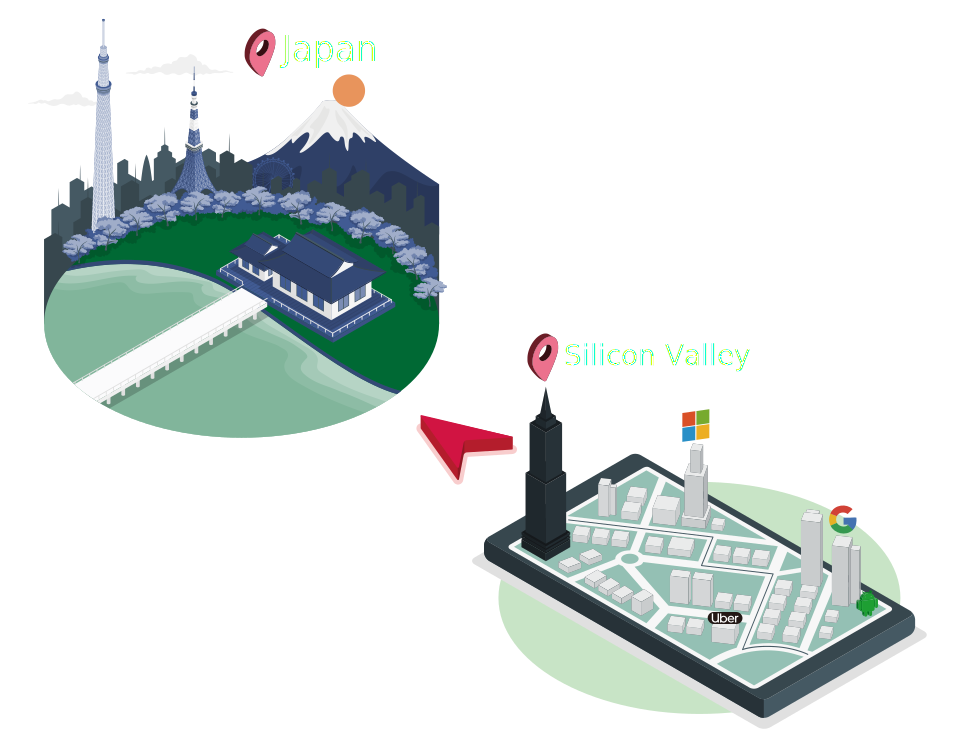

# SEI-CPP

This project is web home page for Cal Poly SE seminar which is written in Gatsby and hosted on Netlify.

## How to use

Run `gatsby develop` to start local server.
Then open `localhost:8000` from your browser.
